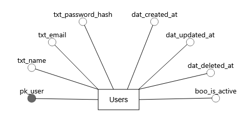

# PhastAuth - Database Documentation

## Table of Contents
1. [Setup Instructions](#setup-instructions)
2. [Configuration](#configuration)
3. [Database Schema](#database-schema)
   - [Core Tables](#core-tables)
4. [Stored Procedures](#stored-procedures)
5. [Functions](#functions)
6. [Visual Documentation](#visual-documentation)

## Setup Instructions

### Initial Setup
```bash
# 1. Copy environment template
cp .env.example .env

# 2. Run database setup script
mysql -u [admin_username] -p < setup.sql
```

### Requirements
- MySQL 8.0+
- Database user with CREATE/ALTER privileges

## Configuration

### Environment Variables
```ini
# DATABASE CONFIGURATION
DB_HOST=                  
DB_PORT=3306              
DB_DATABASE=db_phast_auth
DB_USERNAME=              
DB_PASSWORD=
DB_CHARSET=utf8mb4

# SECURITY SETTINGS
SECRET_KEY=
```

## Database Schema

### Core Tables

#### `tb_users` (User Accounts)
| Column            | Type            | Nullable | Default            | Description                        |
|-------------------|-----------------|----------|--------------------|------------------------------------|
| pk_user           | BIGINT UNSIGNED | NO       | AUTO_INCREMENT     | Primary key                        |
| txt_name          | VARCHAR(255)    | NO       |                    | User's full name                   |
| txt_email         | VARCHAR(255)    | NO       |                    | Unique email address (indexed)     |
| txt_password_hash | VARCHAR(255)    | NO       |                    | Argon2 hashed password             |
| dat_created_at    | TIMESTAMP       | NO       | CURRENT_TIMESTAMP  | Creation timestamp                 |
| dat_updated_at    | TIMESTAMP       | YES      | NULL               | Last update timestamp              |
| dat_deleted_at    | TIMESTAMP       | YES      | NULL               | Soft-delete timestamp              |
| boo_is_active     | BOOLEAN         | NO       | TRUE               | Account status                     |

**Constraints:**
- Unique index on `txt_email`

## Stored Procedures

| Procedure Name             | Description                                                           | Parameters                                                                   |
|----------------------------|-----------------------------------------------------------------------|------------------------------------------------------------------------------|
| `sp_create_user`           | Creates a new user account                                            | `name`, `email`, `password_hash`                                             |
| `sp_get_user_by_id`        | Retrieves user details by ID (validates if user exists and is active) | `user_id`                                                                    |
| `sp_get_password_by_email` | Retrieves password hash for a given email (active users only)         | `email`                                                                      |
| `sp_validate_user_login`   | Validates user credentials and returns user ID if valid               | `email`, `password_hash`                                                     |
| `sp_update_user`           | Updates user information (only modifies provided fields)              | `user_id`, `name` (optional), `email` (optional), `password_hash` (optional) |
| `sp_delete_user`           | Performs soft delete of user account (sets as inactive)               | `user_id`                                                                    |

## Functions

| Function Name              | Description                                                                 | Returns       |
|----------------------------|-----------------------------------------------------------------------------|---------------|
| `fc_check_user_exists`     | Validates if a user exists and is active (throws error if not)              | `BOOLEAN`     |

## Visual Documentation

### Entity Relationship Diagram
  
*Figure 1: Complete entity-relationship model*

### Schema Diagram
  
*Figure 2: Physical table structure with indexes*
